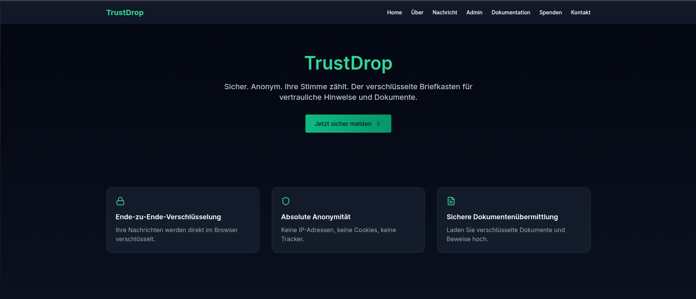
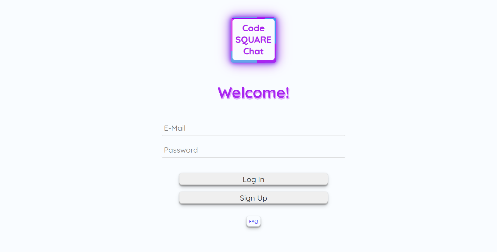
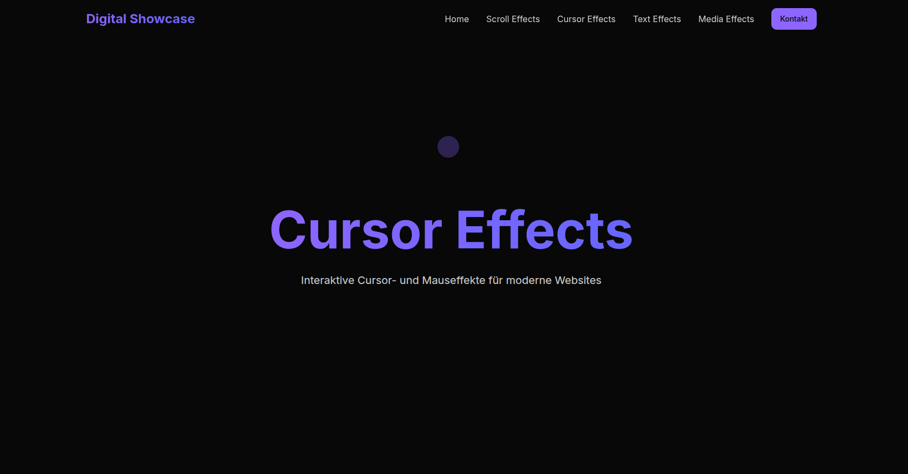

#  <h1 align="center">👨‍💻 Full Stack Web Developer</h1>

## 📫 Contact

| Mail | LinkedIn |
|:----:|:--------:|
| <a href="mailto:fabrice88@gmail.com"> fabricen88@gmail.com</a> | <a href="https://www.linkedin.com/in/fabrice-nadal/" target="_blank"> LinkedIn – Fabrice Nadal</a> |

## ⚙️ Tech Stack
### 🎨 Layout Design

| HTML5 | CSS3 | SASS | Tailwind | Bootstrap | Figma |
|:-----:|:----:|:----:|:--------:|:---------:|:-----:|
|  |  |  |  |  |  |

### ⚛️ Frontend Development

| JavaScript | TypeScript | React | Git | Redux |
|:----------:|:----------:|:-----:|:---:|:-----:|
|  |  |  |  |  |

### 🛠️ Backend Development

| MongoDB | Node | Express | RestAPI |
|:-------:|:----:|:-------:|:-------:|
|  |  |  |  | 

### 🎥 Content Creation

| AdobePhotoshop | AdobeIndesign | CorelDraw |
|:--------------:|:-------------:|:---------:|
|  |  |  |

---

## 🚀 My Projects

### Portfolio - Fabrice Nadal

| Preview  | Links  | Tech Stack  |
|:--------:|:------:|:-----------:|
 | [🌐 Demo](https://www.fabricenadal.com)  [📂 Repo](https://github.com/deinusername/dein-projekt) |    |
| Description |
<table>
<thead>
<tr>
<td colspan="4">

This project demonstrates a modern web application built with a modular architecture using React and TailwindCSS. It features a fully responsive design, efficient navigation with React Router, and is structured around reusable components. As an early-stage prototype, it explores the concept of a customized streaming interface with a focus on performance, styling speed, and maintainability.

</td>
</tr>
</tbody>
</table>

---

### TrustDrop - Anonymous Digital Whistleblower System

| Preview | Links | Tech Stack |
|:-------:|:-----:| ---------- |
|  |**🎥 Demo Video below** [📁 Repo](https://github.com/FabriceMru/trustdrop-whistle) |     |
| Description |
<table>
<thead>
<tr>
<td colspan="4">

TrustDrop is an innovative, web-based whistleblowing system that enables individuals to submit confidential information and files anonymously and securely – without fear of surveillance, tracking, or retaliation.
Inspired by systems like SecureDrop, but with a strong focus on accessibility, ease of use, and modern web technologies, TrustDrop is designed for organizations committed to exposing wrongdoing and promoting transparency – without technical barriers and maximum security.
  
### 🎥 Demo Video:
<video width="480" controls>
  <source src="./assets/trustdropdemo.mp4" type="video/mp4">
  Your browser does not support the video tag.
</video>

✅ Whistleblower Interface, Admin Panel, Security
- Client-side PGP encryption: Messages and files are encrypted locally in the browser.
- No registration, no tracking: Fully anonymous.
- File upload & message input: Can be used together or separately.
- Confirmation code & message codes: For secure tracking and verification.
- Authentication system: Password-protected (client-side only).
- Import of private PGP keys (local): No keys stored on the server.
- Decryption in the browser: Zero-knowledge security model.
- Inbox management: View status, timestamp, message ID, and download files.
- Deployed on Vercel: Fast and globally distributed infrastructure.
- No server-side decryption.
- Content Security Policy (CSP), HSTS, XSS protection: Gradually being fully integrated.
- Open-source architecture planned: Building trust through transparency.

</td>
</tr>
</tbody>
</table>

---

### Code Square Chat

| Preview | Links | Tech Stack |
|:-------:|:-----:| ---------- |
|  | [🌐 Demo](https://codesquarechat.onrender.com/)  [📁 Repo](https://github.com/FabriceMru/nebula-chat) |         |
| Description |
<table>
<thead>
<tr>
<td colspan="4">

CodeSquare Chat (CSC) is a real-time messaging application designed to facilitate seamless communication between users. Developed by a team of four, the application emphasizes an intuitive user interface, responsive design, and robust backend functionality to ensure efficient and secure messaging.

</td>
</tr>
</tbody>
</table>

---

### Watchflix 

| Preview | Links | Tech Stack |
|:-------:|:-----:|:----------:|
|  | [🌐 Demo](https://watchflix-bay.vercel.app/)  [📁 Repo](https://github.com/FabriceMru/watchflix) |    |
| Description |
<table>
<thead>
<tr>
<td colspan="4">

WatchFlix is one of my initial projects, developed to deepen my understanding of frontend development and design principles. This web application serves as a conceptual streaming platform, allowing users to browse and view information about movies and TV series. Emphasizing a clean and responsive user interface, the project showcases my skills in creating engaging and accessible designs.

</td>
</tr>
</tbody>
</table>

---

### Digital Showcase

| Preview | Links | Tech Stack |
|:-------:|:-----:|:----------:|
|  | [🌐 Demo](https://watchflix-bay.vercel.app/)  [📁 Repo](https://github.com/FabriceMru/watchflix) |    |
| Description |
<table>
<thead>
<tr>
<td colspan="4">

Diese Website ist ein Showcase meiner technischen Fähigkeiten und zeigt verschiedene Web-Effekte, Animationen und Interaktionen, die das moderne Web zu bieten hat.

</td>
</tr>
</tbody>
</table>

---
---

## GAMES

### NeonSnakeTwo

| Preview | Links | Tech Stack |
|:-------:|:-----:|:----------:|
|  | [🌐 Demo](https://fabricemru.github.io/NeonSnakeTwoGame/)  [📁 Repo](https://github.com/FabriceMru/NeonSnakeTwoGame?tab=readme-ov-file) |    |
| Description |
<table>
<thead>
<tr>
<td colspan="4">

Neon Snake Two is a modern, browser-based rendition of the classic Snake game, developed as one of my early projects to enhance my understanding of game development and frontend design. The game features vibrant neon visuals and introduces multiple levels to increase the challenge.

</td>
</tr>
</tbody>
</table>

---

### Schiffe versenken

| Preview | Links | Tech Stack |
|:-------:|:-----:|:----------:|
 | [🌐 Demo](https://schiffe-versenken.vercel.app/)  [📂 Repo](https://github.com/FabriceMru/Schiffe-versenken/tree/main) |     |
| Description |
<table>
<thead>
<tr>
<td colspan="4">

Schiffe Versenken is a browser-based adaptation of the classic Battleship game, developed as one of my early projects to enhance my skills in frontend development and game logic implementation. The game offers a minimalist design and intuitive user interface, allowing players to engage in strategic gameplay by attempting to sink the opponent's fleet through coordinate-based attacks.

</td>
</tr>
</tbody>
</table>

---
