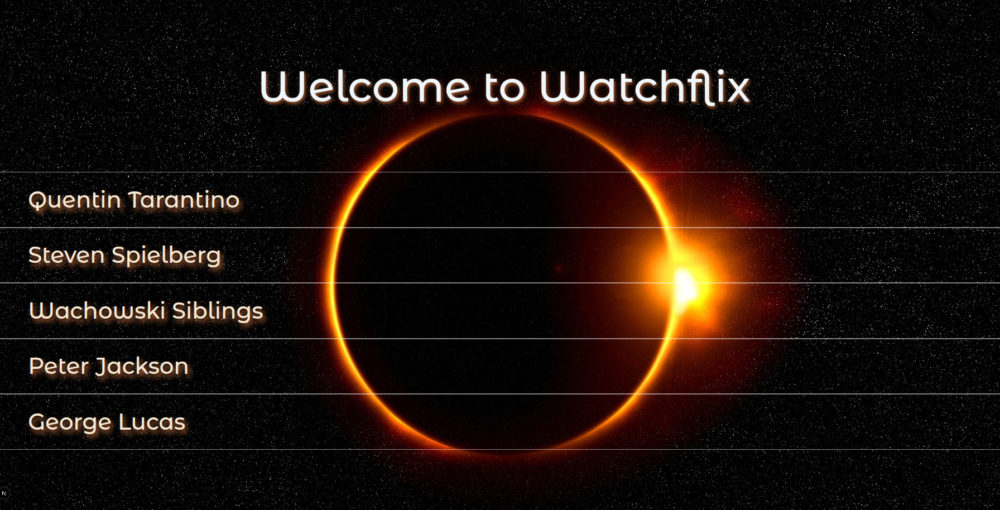
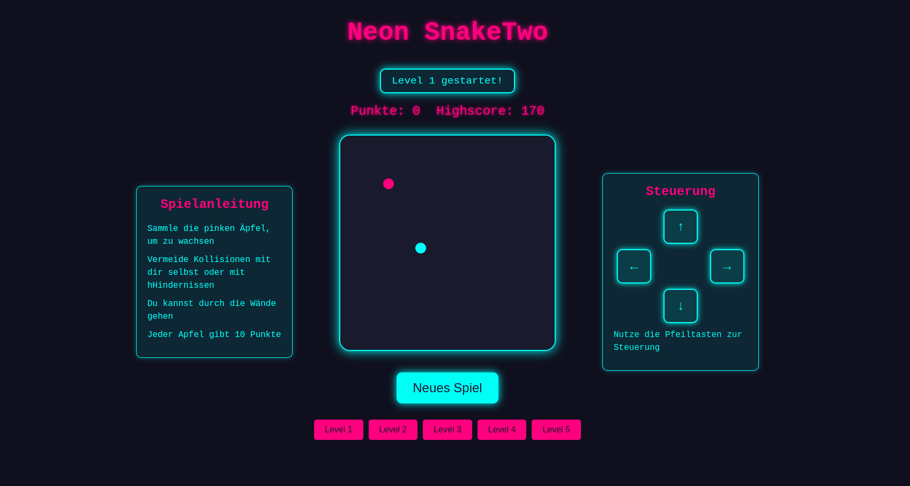
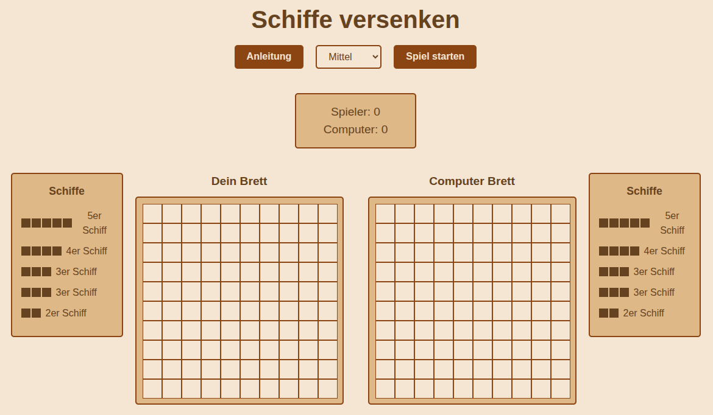

#  <h1 align="center">👨‍💻 Full Stack Web Developer</h1>

## 📫 Contact

| Mail | LinkedIn |
|:----:|:--------:|
| <a href="mailto:fabrice88@gmail.com"> fabricen88@gmail.com</a> | <a href="https://www.linkedin.com/in/fabrice-nadal/" target="_blank"> LinkedIn – Fabrice Nadal</a> |

## ⚙️ Tech Stack
### 🎨 Layout Design

| HTML5 | CSS3 | SASS | Tailwind | Bootstrap | Figma |
|:-----:|:----:|:----:|:--------:|:---------:|:-----:|
|  |  |  |  |  |  |

### ⚛️ Frontend Development

| JavaScript | TypeScript | React | Git | Redux |
|:----------:|:----------:|:-----:|:---:|:-----:|
|  |  |  |  |  |

### 🛠️ Backend Development

| MongoDB | Node | Express | RestAPI |
|:-------:|:----:|:-------:|:-------:|
|  |  |  |  | 

### 🎥 Content Creation

| AdobePhotoshop | AdobeIndesign | CorelDraw |
|:--------------:|:-------------:|:---------:|
|  |  |  |

---

## 🚀 My Projects

### 📁 Portfolio - Fabrice Nadal

| Preview  | Links  | Tech Stack  |
|:--------:|:------:|:-----------:|
 | [🌐 Demo](https://www.fabricenadal.com)  [📂 Repo](https://github.com/deinusername/dein-projekt) |    |
<table>
<thead>
<tr>
<td colspan="4">
<strong>Description</strong>
<ul>
<li>Responsive and mobile-friendly layout</li>
<li>TailwindCSS for rapid styling</li>
<li>Dynamic routing with React Router</li>
<li>Component-based architecture</li>
<li>Early proof-of-concept for a streaming UI</li>
</ul>
</td>
</tr>
</tbody>
</table>
---

Code Square Chat

| Preview | Links | Technical Stack |
|:-------:|:-----:| --------------- |

---

Watchflix 

| Preview | Links | Technical Stack |
|:-------:|:-----:|:---------------:|
|  | [🌐 Demo](https://watchflix-bay.vercel.app/)  [📁 Repo](https://github.com/FabriceMru/watchflix) |    |

---

### GAMES

NeonSnakeTwo

| Preview | Links | Tech Stack |
|:-------:|:-----:|:----------:|
|  | [🌐 Demo](https://fabricemru.github.io/NeonSnakeTwoGame/)  [📁 Repo](https://github.com/FabriceMru/NeonSnakeTwoGame?tab=readme-ov-file) |    |

---

Schiffe versenken

| Preview | Links | Technical Stack |
|:-------:|:-----:|:---------------:|
 | [🌐 Demo](https://schiffe-versenken.vercel.app/)  [📂 Repo](https://github.com/FabriceMru/Schiffe-versenken/tree/main) |     |

---
